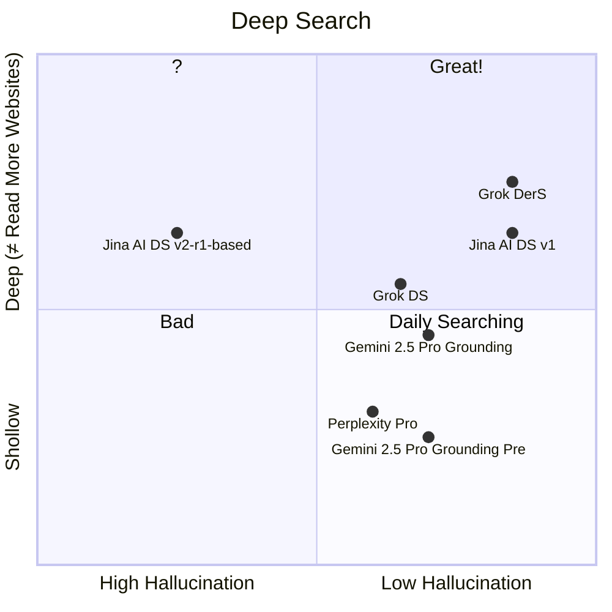
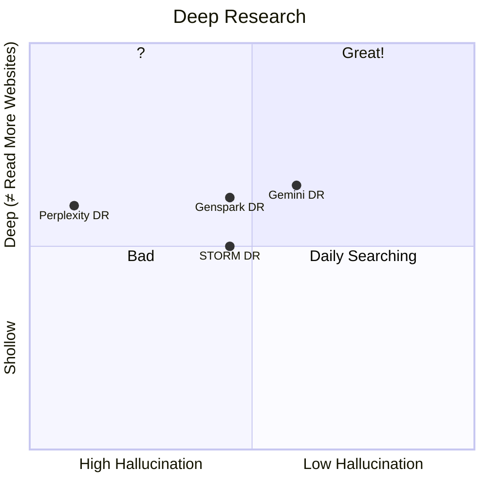

Deep Research & Deep Search

|                                                              |               |      |
| ------------------------------------------------------------ | ------------- | ---- |
| [Gemini](https://gemini.google.com/app)                      | Deep Research |      |
| [h2oGPTe](https://h2ogpte.genai.h2o.ai/)                     | Deep Research |      |
| Perplexity                                                   | Deep Research |      |
| [Genspark](https://www.genspark.ai/agents?type=moa_deep_research) | Deep Research |      |
| [STORM](https://storm.genie.stanford.edu/)                   | Deep Research |      |
| Grok                                                         | Deep Search   |      |
| [Jina AI](https://search.jina.ai/)                           | Deep Search   |      |
| [Komo](https://komo.ai/)                                     | todo          |      |

free LLMs

https://github.com/LLM-Red-Team

|                                                              |              | Speed | Max output token |
| ------------------------------------------------------------ | ------------ | ----- | ---------------- |
| [copilot](https://copilot.microsoft.com/)                    | o3-mini-high |       | > 10k            |
|                                                              |              |       |                  |
| [SambaNova](https://cloud.sambanova.ai/)                     | r1           | 150   | 2048             |
| [flowith](https://flowith.io/blank)                          | r1           | ~30   | > 8900           |
| [lambda](https://lambda.chat/)                               | r1           | ~30   | 8192             |
| [DeepInfra](https://deepinfra.com/chat)                      | r1           | 50    | 8192             |
| [openrouter](https://openrouter.ai/chat?models=deepseek/deepseek-r1:free) | r1           | ~10   | X                |
| [GitHub](https://github.com/marketplace/models/azureml-deepseek/DeepSeek-R1/playground) | r1           | ~20   | 4096             |
| [Groq](https://chat.groq.com/?model=deepseek-r1-distill-llama-70b) | r1 70b       | 270   | 8192             |
| [together.ai](https://api.together.ai/playground/chat/deepseek-ai/DeepSeek-R1-Distill-Llama-70B-free) | r1 70b       | 50    | 4096             |
