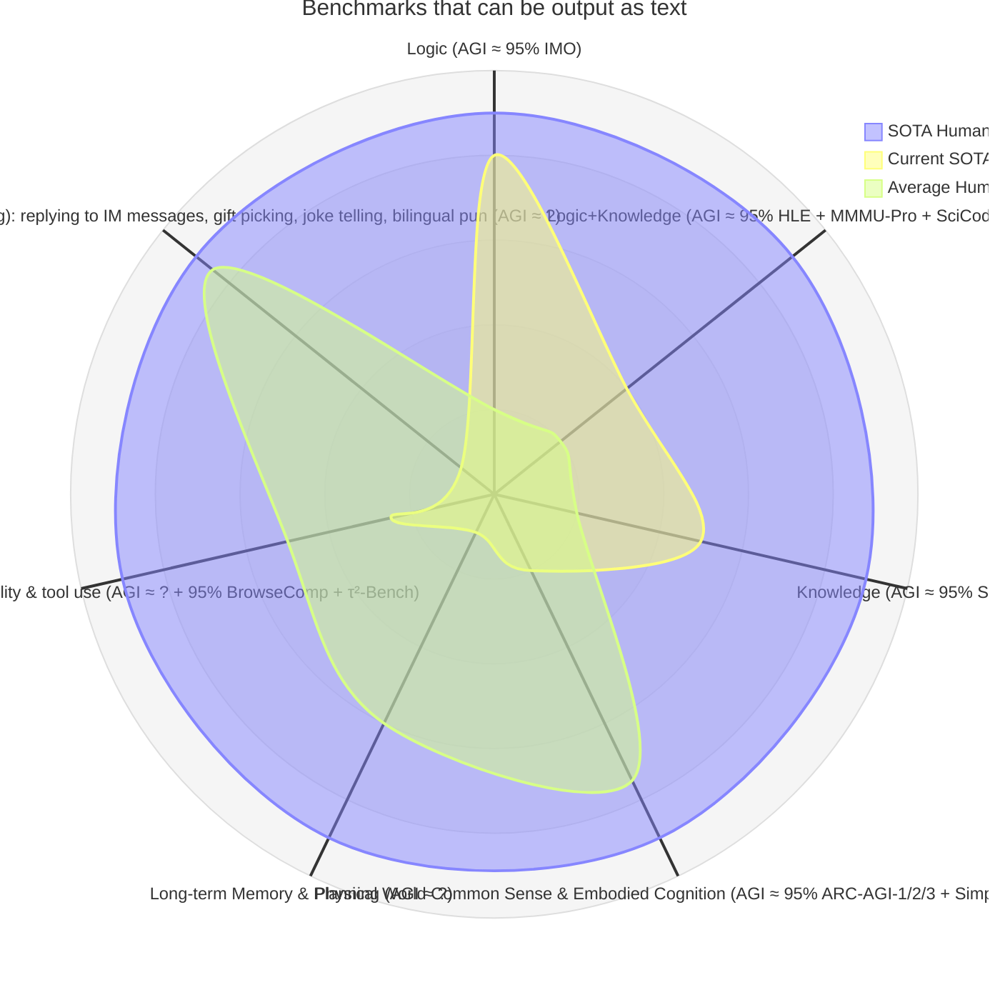

## Thoughts on AI

2024/08/22: 我认为 LLM 的发展向“知识库”方向发展比较有前景，像 Mistral 堆代码和数学的训练数据是错误的方向，数学和代码需要很不一样的训练手段，例如 AlphaGeometry。如果依靠现在 LLM 的训练方式，可能需要 500T 级别的参数量级（此时数据的来源又是一个问题）才能达到人类行业中上水平，或者说认为 GPT-5 的水平会接近业内平均水平，这当然是一个了不起的成就，但是也意味着受限于（目前可预估的）算力，至少在未来 30 年内，不可能通过这种通用 LLM 的方式到达超过业内的 top 10% 水平。类似的，人脑中负责语言和数学的中枢显然也是两个。

2024/11/03: o1p 出来有段时间了，试用了几次，颇为惊艳，其数学能力可以说从速度和质量上绝对已经超过工科学生闭卷平均水平（当然，如果允许学生使用 MATLAB, Python 等工具则是另当别论，因为这也是工科学生典型的场景），而数学和物理等专业较为优秀的学生尚与 o1p 有一战之力。

2024/11/21: 究竟什么容易被 AI 替代？在 Gen-AI 出来之前，主流观点认为 Art 和 Scientific-Research 是 AI 难以替代的两座高山；Gen-AI 井喷式增长后，人们又认为 STEM 相较于文科难以被 AI 替代。从传统的角度思考，我们可以认为 

- ①资料易于被数字化、资料数字化程度高
- ②可用于训练的资料内容多、质量高、定量化评价体系清晰
- ③产出形式单一、数字化程度高

的行业容易被取代。我们不妨先举几个例子：程序员、作家在这种评价标准下容易被取代，而流水线工人（注意此处讨论的是 AI 而不是自动化）、保险经纪人在这种评价指标下难以被取代。司机在媒体的宣传中是非常容易被取代的职业，但是它并不满足我们提到的要求，直到 Tesla FSD V12 的出现。我们细化这三点的同时再举一些例子：

- 满足①而不满足②③的例子是最广泛，有法律、作曲家等一系列所谓的“白领”，每天和电脑打交道的时间长于和人打交道的时间。
- ②可用于训练的资料内容多且质量高，不代表这些数据要是公开的或者开源的，只要有数据即可。例如画家反对 AI 训练，但是大公司直接无视法律风险，直接继续使用大量数据训练；Tesla 收集全球用户的驾驶数据用于训练 FSD。从 2022 LLM 高考语文的水平高于高考数学，到 2025 LLM 满分的高考数学和略微进步的高考语文，就是定量化评价体系中的差别。AlphaGo 也是同理，首先竞技性游戏的评价极为单一和清晰，其次，使用合成棋谱进行 RL。
- ③程序员相较于产品经理恐怕更危险。更宏观的，技术员相较于管理者可能更危险，不过这也是千百年来的主流了。但是这非常危险，因为虽然 AlphaGo 的出现并没有使围棋从业者显著减少，但是对于对着电脑的工程师可没有什么*艺术*可言（会有一些传统和固执工程师说做到极致就是*艺术*，我们先不论证这个），残忍地说，当螺丝钉不能发挥其作用时，其归宿只有垃圾堆。
- 三点都不满足的有农民、蓝领、服务业，这类往往是我们所忽视的“大多数”。当然，实时表演艺术（不包括画家、作曲家，但包括杂技、演奏者）也是难以被直接替代的，但是这就是一个小众领域了。

2025/02/07: **2025 年不会是 AI Computer Agent 的元年。** 更悲观的说，2025 年的 Agent 就像 2000 年本田开发的 ASIMO，年年是元年，但是恐怕始终难堪大用。主要是两点原因：①目前多模态模型的部分短板仍远逊于普通人 ②Agent 在工程上是一个很复杂的问题，Agent 意味着从做题到实践的巨大进步，而且短时间内难以通过基模的提升来解决。其他一些小问题，比如 context window 短、模型后天学习能力、强基模延迟高速度慢价格高、Agent Benchmark 不明晰等等问题，都有望在 2025 年解决。当然啊，还有一个房间里的大象——非公开语料，这对于 AGI 和 Agent 都没有影响，但是对于更好地帮助工作可能有一定影响，因此我相信非公开语料已经不是 OpenAI 和 Google 所关心的主要内容了。

OpenAI 的 Operator 和 Deep Research 从目前的能力上来看还是做题，而非 Agent：Operator 目前只能完成定义清晰、目标明确的简单网页操作，而 Deep Research 更像是一个以自己知识面作为常识，结合公开信息作为辅助判断的做题者。AI Agent 的第一步就是*完全*取代中低端程序员，这也是 Agent 中最简单的一步，配合①更强的多模态模型 ②context window 的 trick ③联网搜索的 trick，还是有机会在 2025 年晚些时候实现的，因为这满足 2024/11/21 观点三条特征。但是正如 AI 永远无法到达 100% 正确率的彼岸一样，不要小看*完全*二字啊，从需求到 demo 完全不用人辅助的一次成功率恐怕在 2025 年难以突破 50%。至于 OpenAI 机器人？那更是遥远的彼岸，会和可控核聚变一样，被物理世界的残酷一次次拖延。未来可能是通过 AI 辅助编写并创新传统的控制方式代码，来实现可以操作物理世界的 Agent ？不过这太远了，我站得太低，而地球又是个球，看不到彼岸啊。

我们在 2025 年期望看到什么？知识面更广更深的做题模型，但是快到头了，而且很显然到不了 AGI；更好的多模态模型，仍有不少发展空间；更多基于 AI 的可有可无的软硬件，火得很，但并非未来；一些打着通用 Agent 旗号的专用 Agent。没有了。人们追求 Scaling Law 的能力远不如追求 Moore's Law 的能力，而不是说 Scaling Law 已经失效了。LLM 会被写入历史书吗？有可能，但是最多最多就是边角的一块豆腐干罢了。

2025/02/15: 从种种小众代码的场景来看，LLM 对训练数据的利用率太低。所以唱一个反调：pre-training 未必到头，只能说基于 GPT 形式和传统 pre-training 方式的、通过 scale-up 来提升性能的 pre-training 到头了。预计 200B 左右 (4o, Sonnet 4, Llama 4) 的 Dense 或者 MoE 的 LLM 仍有不小的提升空间才会饱和（如果要定量的话，认为 200B LLM (w/o RAG) 在 2025 年底达到 GPQA/SimpleQA 90%+；另外一个预测是 HLE/SciCode(Main) 40%+，只不过 pre-training 在其中作用不大了）。唉，还是在做题啊。不过也好，更强的做题能力确实是 Agent 的必要条件。

2025/02/19: 从 GPT3.5-Turbo 到 GPT4 再到 Grok3 的 Arena Hard w/ Style Control 两两间的分差大概都是 100+ 的样子。100分对应64%的胜率，200分对应76%的胜率，很难想象 Grok3 对 GPT3.5-Turbo 的优势居然不是 90%+。由此可见，让普通用户问普通问题是无法高效区分 LLM 能力的。

2025/02/25: 去年，Jensen 和 Zuckerberg 有一次公开对话，其中两人对 LLM 的未来是专用还是通用有着不同看法：Jensen 认为通用 LLM 是未来，人们无不希望在各方面都更强大的 AI；Zuckerberg 则认为专用是未来。今日，Sonnet 3.7 发布，过去以来一直认同 Jensen 观点的我产生了动摇。随着 scaling law 的瓶颈愈发显现，应该用 200B 的参数训练一个啥都过得去，但是不专精的通用 LLM；或是用 200B 的参数训练一个更专精于代码的模型，以此在该领域产生真正的“价值”？这个问题在过去可以随意 scaling 的时代是不存在的，而且这不仅是一个技术问题，更是一个商业问题。To be, or not to be, that is the question. 也许 UCB 的 experiment-router，后端配上具有一定通用能力的多个领域专用 LLM 才是未来？人类社会也是如此啊。但是除了数学、理论物理、计算机等少部分信息公开程度高、定量化评价体系清晰 (RL 方便) 的领域可以方便地使用传统方法训练 200B 左右的专用 LLM，其他领域的专用 LLM 还是面临着两个问题，一是 AI 领域老生常谈的问题——少样本训练，二是性价比——小企业的工厂里为什么自动化程度不高？因为对于小批量细分领域，人比机器便宜，主要原因是 robustness 和 versatility。

2025/02/28: 除了 A 家的大基模以外，GPT4.5, grok3, Gemini 2 Pro 都已上菜完毕。More Scaling 已经基本结束; More than Scaling 方兴未艾; Beyond Transformer 遥不可及。

2025/03/06：LLM 需要一个推理 FoM 值，类似于 $\log(1/\text{average end time}\cdot\text{average first token time}\cdot\text{average token})\cdot \text{Raw Performance}$ 之类的。QwQ 32B 的推理过程动辄消耗 2 万个 token，不比 preview 版好多少，仍然是刷榜的废物。Groq 之类的硬件加速方案还是有一定前途的，就等 Jensen 下场了。

2025/03/24: 加入 HardQA (SimpleQA 的困难版本，需要阅读大量网页和一点点的推理能力才能答对，利用 LLM 自身知识储备几乎不可能答对)。2025/04/11: OpenAI 的 BrowseComp 基本上就是也。更印证了没有一家在解决模型说“不会”的能力，而都是在通过加强模型能力来减轻幻觉的影响。

2025/03/30: Deepseek v3-20250324 和 OpenAI 4oL-20250326 从 benchmark 结果来看应该是用了非常类似的方法。很难想象 Perplexity 和 Cursor 这种产品的估值会如此之高，应用层没有护城河，时间会碾碎一切的。今天闲，再写一点预测吧：Llama 4 通用任务的文字能力(不考虑多模态)非推理水平应该在 Claude 3.7 左右，恐怕是不如 v3-20250324 / Gemini 2 Pro / 4oL-20250326 的。GPT5 和 Claude4 才是真正的 Game Changer，就等下半年体验了，这个预测不准的。

2025/04/06：Qwen3 的 llama4 压力小多了，但是内在压力还是挺大的。如果五六月份发布的 Qwen3 72B 目标是和 ds-v3.0 乃至 Qwen2.5 Max 打平，还是难的，估计今年年末或者明年年初的 Qwen3.5 72B 有戏，如果那时候还发 Dense 的话。但是我认为这个尺寸就是应该发 dense 的，至少 llama4 Scout 的失败会让业界长记性的。

2025/05/01: benchmark 确实是 AI 未来两年内最大的问题。通过 reasoning 刷 AIME, 刷 HLE(评测集里面数学题 40%, 物化生各 10%), 刷 GPQA Diamond (考虑到是四项选择题，现在的正确率看来好像也没那么好刷) 本质上都是为了解决真实世界问题而做准备的考试。这些学科的答案清晰，但是对于 Engineering 和 Social Science 问题则更为复杂。上半年唯一比较满意的 benchmark 是 openai 的 BrowseComp。当然，现在这个问题还没有体现出来，因为 AI 的全方面能力提升似乎还有余量，所以各团队尚未对这些学科针对性的优化。但是到今年年底的时候，reasoning 的红利类似于 FinFET 一样被彻底吃干净的时候，如果仅由 GPQA, AIME 和 HLE 来引导 LLM 下一步的发展方向，只会发展出类似于 AlphaGo 的专用人工智能，而不是通用的。虽然我高度怀疑 Google 内部现在应该是有团队在向哥德巴赫或者黎曼之类的东西发起冲锋的，就像曾经的围棋一样，当这一步成功的时候，数学可能就会比围棋率先走到尽头了。如果 Google 能在 2030 年之前做到，那么世界上将再无 OpenAI。

2025/06/01: 一个月过去了。Claude 4 Opus 来了，而 o4 还很遥远；Gemini Diffusion 和 gpt-image-1 来了，而全模态输入输出还很遥远。如果 Gemini 3 无法引领 Benchmark 分数进一步进步，下半年恐怕只有应用层面创新的 GPT5 了。Autoregressive 确实是快到头了，Sudoku-Bench 和 ascii-art 等等一系列顶着 Autoregressive 打的 benchmark 越来越多才是好事；当然，这个我也早有体会，比如让 AI 解一个 5-OTA + CS 的二级运放的 PSRR 之类的问题也是因为这个完全不行 。AGI 或是全方面超越人类的 ASI 不可能通过纯文字实现的，所以即使证明出哥猜也不是 AGI/ASI，不然 AlphaGo 就是一种 ASI 了。顺便再来接着 0501 的碎碎念，喷一下 Benchmark 过于注重理科而轻视工科的问题，是是非非曲曲折折，unspoken rules 让 AI 摇摆不定。

2025/07/05: 直至今日，所有 Agents 都还不堪大用。输入能力：context 能力、现场学习能力、视觉能力；输出能力：鼠标操作。

2025/08/03：写在 GPT5 发布前夕。

2025/08/04: 自己 2025/08/03 (Jagged Performance) 和 2024/11/21 (替代难度) 两个想法和 Jason Wei [不谋而合](https://youtu.be/twXsAiTINO0)还是很高兴的。但是 2025/02/07 这个小众语料的预测应该是和 OpenAI 相反了，OpenAI 内部应该还是[重视](https://youtu.be/twXsAiTINO0?t=2131)这些的。[asymmetry of verification](https://www.jasonwei.net/blog/asymmetry-of-verification-and-verifiers-law) 这个观点是我之前完全没有想到的，之前只想到了 verification，没想到 asymmetry。另外，我今天才知道 Jason Wei 是 SimpleQA 和 BrowseComp 这两个我很欣赏的 benchmark 的一作。

2025/08/05: 看来泛化能力只是一个美化的谎言，2025 年 OpenAI 还是官方钦定英语 Benchmark 效果[最好](https://youtu.be/twXsAiTINO0?t=1864)；Chinese 的数据点很特殊，不知道为什么。昨天小众语料的想法也是这个的体现。

2025/08/05：又想到了这个 2025/03/06 的 FoM 值问题。模型总参数量、激活参数量、总输出长度、并行推理个数 这四个数据可以推出所谓的模型 "推理 Benchmark FoM"；再加上训练数据量应该可以推出 "训练 FoM"

2025/08/06: gpt-oss 基本上就是一个做题模型，还基本上只会数学题（HLE 里面一半都是数学题）。开源部分中有价值的是 harmony 和 mxfp4，其他没有任何价值。benchmark 相较于 Qwen 的两个 MoE 也只是有来有回罢了。OpenAI 应该是把可以赚钱的部分（HLE SOTA 和 coding）留给 GPT5 了。另外，我们需要一个 Humanity Last Benchmarks 组，来涵盖所有方面的知识。华为没有成为中国的 groq 还是有点遗憾的。

## 评测的小 ideas

### Bode

由 Bode 图想到是不是可以使用 Bode 图的方式更好的展示不同模型在不同难度下的性能情况。在简单的情况下，小模型的表现有可能会比没有特调过的大模型好；而在多种测试条件下表现良好的小模型在复杂问题下的能力衰退可能会很快，然后如果要求平均能力，直接求个积分就行。如果需要多领域的情况可以使用六边形的立体 Bode 图。

但是这个图要求我们有大量不同难度的测试集，其中比较容易想到的是数学的评估，因为其客观性比较强，我们可以将横轴取小学6年，中学6年，本科4年，硕士3年，共19各数据点的原创数学试题作为评估，拟合出一些漂亮的数学能力 Bode 图。或是小学奥数+初中奥数+高中奥数等...

