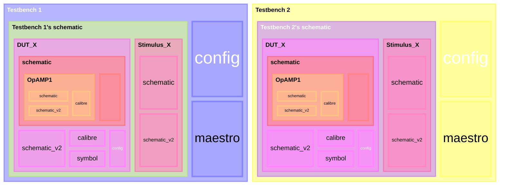

## Config & Hierarchy Editor

## 引言

本文假设读者具有一定的 config 设置基础，以及在 ADE Assembler 中设置 config sweep 的经验。

## 一般情况

我们假设一种最一般的情况：有一套 "DUT_X" 正在被两个 testbench - "Testbench 1" 和 "Testbench 2" 同时验证；"DUT_X" 有两套 schematic，其中第一套 `schematic` 里面有 "OpAMP1" 和 "OpAMP2" 两部分组成；而 "OpAMP1" 内又有两套设计，分别是 `schematic` 和 `schematic_v2`。详见下图：

## 问题集

### 问题一

[Set Up a Config View to Easily Switch Between Schematic and Calibre of DUT for Multiple Testbenches](https://community.cadence.com/cadence_technology_forums/f/custom-ic-design/62851/how-to-set-up-a-config-view-to-easily-switch-between-schematic-and-calibre-of-dut-for-multiple-testbenches)

OP 提出三个问题，本质上就是一个问题：

> Best practices for using **a** `config` view for "DUT_X" that can be used to easily switch between the `schematic` and `calibre` views, impacting both "TB1" and "TB2"?
>
> 如何通过**一**个 `config` view，方便地切换 "DUT_X" 的 `schematic` 和 `calibre`，并让这个设置同时作用于 "TB1" 和 "TB2" 这两个 testbench？

给出了两种方案：

> 1. If you put both tests in the **same** `maestro` view, you can use a global `CONFIG` variable for this pupose.
> 2. It is also possible to select **another** `config` view in the *hierarchy editor*, so you could create a `config` view with the desired settings for your "DUT" and then select it in the `config` views of both testbenches.

### 问题二

> `config` sweep in ADE Assembler on the instances "OpAMP1":
> - Works well if the instance "DUT_X" is bound to `schematic` view in `config` of the "Testbench1"
> - However, when the "DUT_X" is bound to `config` of "DUT_X" (A nested `config`, and the hierarchies inside "DUT_X" doesn't change), the netlist seems to be generated based on the bindings in `config` of "DUT_X" and the `config` sweep settings in maestro are not honored

简而言之是不支持，而且 Virtuoso 不会报任何 warning 或 error：

> You can only sweep what is present at the top-level `config`, but not what is in a level below as everything defined under `config` of "DUT_X" in your case.

此处值得思考，因为 top-level `config` 和 top-level `schematic` 实际上是两个不同的东西。我们假设四种情况：

1. 在 Testbench 1 的 `config` 使用 spectre 默认模板，即都使用 `schematic` view；然后在 ADE Assembler 的 global config sweep 中只设置 "DUT_X" 使用 `schematic_v2` view
2. 在 Testbench 1 的 `config` 使用 spectre 默认模板，即都使用 `schematic` view；然后在 ADE Assembler 的 global config sweep 中只设置 "OpAMP1" 使用 `schematic_v2` view
3. 在 Testbench 1 的 `config` 中将 "DUT_X" cell 设置使用 `calibre` view；然后在 ADE Assembler 的 global config sweep 中只设置 "DUT_X" 使用 `schematic_v2` view
4. 在 Testbench 1 的 `config` 中将 "DUT_X" cell 设置使用 `calibre` view；然后在 ADE Assembler 的 global config sweep 中只设置 "OpAMP1" 使用 `schematic_v2` view
5. 在 Testbench 1 的 `config` 中将 "DUT_X" cell 设置使用 `calibre` view；然后在 ADE Assembler 的 global config sweep 中设置 "DUT_X" 使用 `config` view，"OpAMP1" 使用 `schematic_v2` 
6. 在 Testbench 1 的 `config` 中将 "DUT_X" cell 设置使用 `calibre` view；然后在 ADE Assembler 的 global config sweep 中设置 "DUT_X" 使用 `schematic` view，"OpAMP1" 使用 `schematic_v2` view
7. 在 Testbench 1 的 `config` 中将 "DUT_X" cell 设置使用 `schematic_v2` view；然后在 ADE Assembler 的 global config sweep 中设置 "DUT_X" 使用 `schematic` view，"OpAMP1" 使用 `schematic_v2` view

此时我们知道：

- 情况 1 和 2 中，我们是可以在 hierarchy editor 中看到 "DUT_X", "OpAMP1" 和 "OpAMP2" 都是使用默认的 `schematic` view；top-level `config`，即  Testbench 1 的 `config` 中存在对于 "OpAMP1" 和 "OpAMP2" 的设置
- 情况 3, 4, 5, 6 中，则只有 "DUT_X" 的 `calibre` view，因为对于 "DUT_X" 的整体抽寄生 view 而言，"OpAMP1" 和 "OpAMP2" 已经是不存在的概念了；此时的 top-level `config`，即  Testbench 1 的 `config` 中只能看到对于 "DUT_X" 的 `calibre` 设置。

所以情况 1, 2, 3 生效是必然的，情况 4, 5 不生效也是必然的。比较特殊的是情况 6 和 7，实测也是会生效的。即 ADE Assembler 中 global config sweep 会具有更高优先级，可以覆盖 `config` view 中的设置。

但是这样跑 6 会有一个问题，即 "DUT_X" cell `schematic` 内部的所有信号仿真结果不可见，比如 `schematic` 内部有一个节点 `v_inner`。ADE 的结果保存机制会认为 "DUT_X" 的 `calibre` view 中没有 `v_inner` 这个节点，所以画出不波形图，虽然我们实际上仿真跑的是 "DUT_X" 的 `schematic` view。跑 7 时，如果 `schematic` 和 `schematic_v2` 都有内部节点 `v_inner` 则可以正常。

### 问题三

#### 问题三的引子 —— Virtuoso 中的 switch view list 和 stop view list

> The switch view list is used to enable you to designate the priority of each view for hierarchical netlisting. It's a fundamental component of how Spectre netlister traverses and processes design hierarchy.

当我们在 CIW 中输入 `envGetVal("spectre.envOpts" "switchViewList")` 时，会返回 `"spectre cmos_sch cmos.sch schematic veriloga"`。这串字符串的含义是，当我们不使用 `config` 设置 hierarchy 时，如果一个 cell 既有 `schematic` 的 view，又有 `veriloga` 的 view，则 Spectre 的 netlister 会优先选择 `schematic` 而不是 `veriloga`。当我们需要修改 Virtuoso 中所有调用顺序时，我们可以直接修改这个环境变量；而当我们要修改某 cell 的调用顺序时，我们便采用 config 和 hierarchy editor。

> [!NOTE]
> 网上搜索显示的 `envGetVal("asimenv.startup" "switchViewList")` 这个环境变量已经不存在于新版 Virtuoso 中了。

类似的，在使用 hierarchy editor 编辑 `config` 时，右上角的 Global Bindings 也展示了目前 config 下的 view list 和 stop list。

https://community.cadence.com/cadence_technology_forums/f/custom-ic-design/40967/per-test-config-variables-in-ade-xl/1358598

### 复制问题

Update Instance - Of New Copies Only

把 DUT_TB 复制为 DUT_TB2 时：

- 不选："DUT_TB2" 的 `config` 中仍是 "DUT_TB"；"DUT_TB2" 的 maestro view 的 design 仍是 DUT_TB
- Of New Copies Only:
- Of Entire Library: DUT_TB 的 config 也被更新为 "DUT_TB2"
