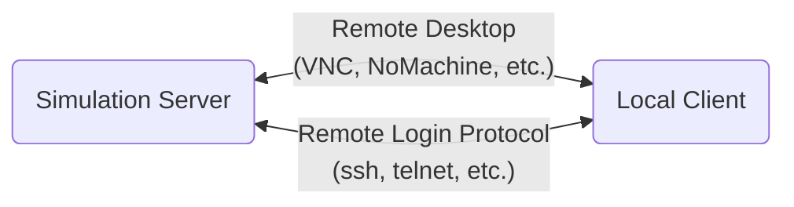

## 

如何让 Virtuoso 在仿真完成后在电脑上通知你？

如何在手机上实时查看 Virtuoso 的仿真进度？

> 参考资料
>
> `Explorer.pdf` - Setting Up Explorer Environment - Using Signals or Triggers
>
>  `maeSKILLref.pdf`

考虑到大家的仿真服务器一般是公司或学校的内网服务器，一个最最简单的网络架构即：

### Virtuoso → Server OS

### Server → Client

