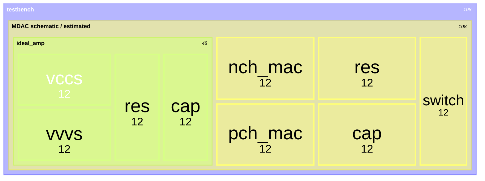
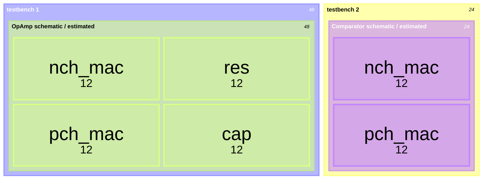

## Parasitic Aware Design (PAD) Flow

主要参考文档：

> PAD_RAK_v617.pdf: Parasitic Aware Design (PAD) Flow Rapid Adoption Kit (RAK)
> parasim.pdf: Virtuoso Parasitic Aware Design User Guide
> Automatic_Schematic_Resistance_Estimates_Methodology.pptx

版本：IC 23.1

结论：这个功能不怎么好用，也不怎么可靠

在如下的示例中：

使用 `estimated` cell 时 netlist 中的 `ideal_amp` 居然整个都消失了。而 `schematic` cell 则是完全完全正常。Cadence 官方的 Parasitic Aware Design RAK 和 ADC Verification RAK 确实都是在以下情况时使用 `Parasitics/LDE` 功能：

说明确实没啥人用这个功能，但是我依然觉得这个功能明明是挺必要和具有前瞻性的。
