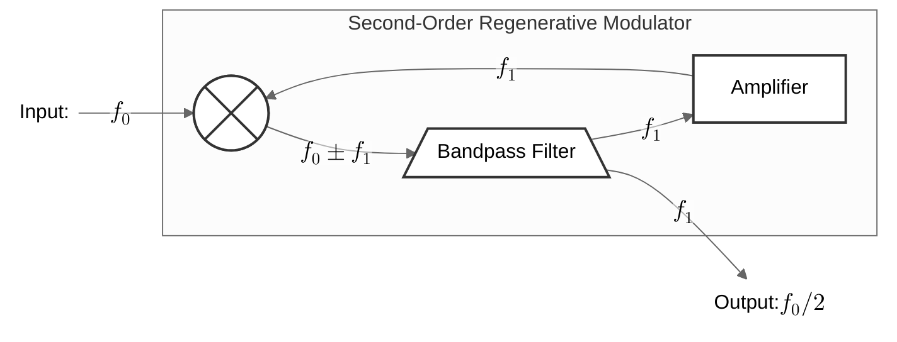
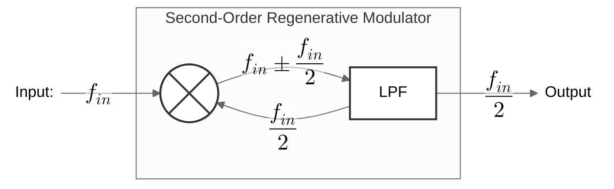

# Divide-by-2 Circuit

如何二分频？如果你使用图片搜索，会得到一堆 DFF $\bar{Q}$ 连接 $D$ 的分频电路。我们认为这种从数字角度的时域理解还不够本质，因为当我们想要回答一些更底层的问题，例如二分频至少需要几个 MOSFET，或者如何在 40GHz 实现二分频时，需要我们从更本质的角度理解分频。

## Regenerative (Modulator) Frequency Divider (Miller Divider)

### Block Diagram

首先 LTI 系统不能产生新的频率成分，所以我们肯定需要 non-linear 和 time-variant 两者中的一个。我们引入 Mixer 来产生新的频率成分，并通过反馈，选择性地放大 $\dfrac{f_{in}}{2}$ 分量，衰减其他分量，便可得到 Miller 在 1939 年提出的 Regenerative Modulator Frequency Divider: 

什么东西被 *regenerative* 了？我们知道在 [regenerative latch](https://youtu.be/sVe3VUTNb4Q?t=2107) (或 regenerative comparator) 中，我们可以把不那么 "0" 和 "1" 的数字信号通过**正反馈** regenerate 成非常 "0" 和 "1" 的数字信号。

如果我们假设是 Mixer 和 LPF 中至少有一个是有源时，可得到 Razavi PLL 15.6 节的框图：

其中一种电路实现类似于 Razavi PLL Fig 15.43 (b) 的实现，使用了无源 Mixer + 有源 LPF 实现。不过其实之前出现的 Fig 15.11 和 Fig 15.19 都是这种 regenerative *modulator* frequency divider，由 $\text{CK}, \overline{\text{CK}}$ 驱动的 MOS 本质上就是一种 *mixer*，只不过此时的 LPF 和增益提供电路相较于 Fig 15.43 (b) 电路更难体现。

### DFF?

如果我们回想 DFF，我们知道一个基本的 Master-Slave 静态 DFF 中也存在着 *regenerative* latch，那么可以从模拟的角度分析看作是一种 *Regenerative* Modulator 的 Frequency Divider 吗？可以在其中找到 mixer 和 LPF 吗？

to be continued

### Schematic

## Injection-Locked Oscillator

Fig 15.11 和 Fig 15.19 也是一种 Injection-Locked Oscillator ？todo

ref:

1. *Design of CMOS Phase-Locked Loops, 15 Divide-by-2 Circuit Design*, Razavi
2. [Fractional-Frequency Generators Utilizing Regenerative Modulation](https://ieeexplore.ieee.org/document/1686949), 1939
3. [The Design of a Millimeter-Wave Frequency Divider](https://ieeexplore.ieee.org/document/9950767), Razavi, 2022

