# Analog IC Learning Resouces

## General EE

[kennethkuhn.com/students/](https://www.kennethkuhn.com/students/)

## Basic & Advanced Analog IC

### Behzad Razavi

- book & solution
  - 中文版翻译质量极高（甚至纠正了一些原版的错误），适合初学者（模电基础还是需要的） ⭐⭐⭐⭐⭐
  - 网上的作业答案有三个版本：手写版、电子版、icdesign.com 版，其中从试看的视频质量来看 icdesign 版是不推荐购买的，手写版和电子版都有不少错误（特别是噪声那一章） ⭐⭐
- courseware
  - 课题组[网站](https://www.seas.ucla.edu/brweb/teaching/)上提供了 courseware、配套作业和考试的题目和解析
- video
  - 广为流传的视频 Electronic Circuits 1 是 Razavi 的模电授课，而不是模集，内容偏基础
  - 本书的中文译者之一张鸿老师网课可参考 ⭐⭐⭐
  - Razavi Electronic Circuits 2 是高等模拟设计

### Phillip E. Allen

- book & solution
  - 他的书不适合初学者使用，目前最新的中文第三版翻译仍有一些机翻痕迹，但也不至于像网上说的有很多错误（意思就是还是有一些错误的）。不过书里面把 $V_{TH}$ 记作 $V_T$ 真的是不爽
- courseware (免费部分)：
  - 他个人网站上的，新一点：[2016 Short Course Notes – AICDESIGN.ORG](https://aicdesign.org/2016-short-course-notes-2/)
  - 他大学网站上的，多一点：[Phillip Allen--Professor (gatech.edu)](https://pallen.ece.gatech.edu/00courses.html)
- video：
  - 个人网站上有[售](https://aicdesign.org/product-category/academic-courses/)他亲自讲解的书每章的 course，$45 一章，不便宜，网上找不到相关资源。也有更面向[产业界](https://aicdesign.org/product/design-procedures-for-analog-integrated-circuits/)一点的课，更贵
  - Bilibili 上东南大学吴金老师的网课（有两个版本，老版本更深更全）可以参考，网课不像书本往往直接给出一个电路图，来进行“逆向”分析，网课会讲述电路的“正向”设计思路，即这个电路是怎么思考产生的。在 eetop 上有配套 slide 可以下载。所以说看书和上课都很重要，不可能看完四本书就无师自通的 ⭐⭐⭐⭐

### Ali Hajimiri

线性时变相噪模型提出者捏，强的很捏，不过这里不放 RF 的东西捏。这个总体感觉这个老师数理背景很强（比如硅的导热性能比黄铜好之类的）。

- book & solution
  - 网站上有 [Resources - CHIC (caltech.edu)](https://chic.caltech.edu/links/)，不过模拟 IC 的书 Hajimiri 还没写完，是草稿，看进度估计没再 5 年写不完
- courseware
  - 手写板书，无
- video
  - Bilibili 上有转载，Hajimiri 的视频算是高教学质量视频中比较新的了，推荐观看（相比于张鸿老师的电流声、吴金老师的画质而言，观看体验也好不少） ⭐⭐⭐⭐⭐

### Boris Murmann

Murmann 在 2023 年从 Stanford 跳槽到夏威夷大学去了，不知道为什么。在夏威夷大学没开高等模集的课，开了一个开源 EDA 模集设计课。其他的可以看看 [Boris Murmann: GitHub](https://github.com/bmurmann)，因为这个老师相对年轻，GitHub 用得很多。

- book & solution
  - *Systematic Design of Analog CMOS Circuits Using Pre-Computed Lookup Tables* ⭐⭐⭐
- courseware
  - Stanford EE214B, *Advanced Analog Integrated Circuit Design*. 我目前网上搜到的最新版本是 Winter 2017-18 ⭐⭐⭐⭐
- video
  - 暂无公开资源

### R. Jacob Baker

- book & solution
  - Baker 总体的研究领域以及一本比较新的书 *CMOS Circuit: Design, Layout, and Simulation* 都算是全定制 CMOS 设计，有数字/混合信号的部分，不过 ADPLL 之类的章节倒是在“初等”模拟设计中比较少见的，可以在看完 Razavi CMOS 中关于传统 PLL 介绍后，作为一个入门性质的补充。其 ADDA 相关章节也可供入门参考。
- courseware/video
  - [R. Jacob Baker's courses](https://cmosedu.com/jbaker/courses/courses.htm) 可参考，目前公开的最新资源是 [2020 模集](https://www.cmosedu.com/jbaker/courses/ee420_ecg620/s20/lec_ee420_ecg620.htm) 和 [2016 高等模集](https://www.cmosedu.com/jbaker/courses/ecg720/s16/lec_ecg720.htm)

### Gray & Sansen & Kenneth Martin

todo

### MIT / UC Berkeley

[MIT OpenCourseWare](https://ocw.mit.edu/search/?q=Analog+Integrated+Circuits) 的问题是内容非常老，虽然 PPT 啥的质量都是极高的，耐不住 2000 左右的内容。

UCB 的 EE140/240 相对好一些，大概 2010 年左右的视频。（不过画质看上去像是 2000 年的）

### FDU

两级运放、唐长文差分运放

### THU 孙楠

- book
  - 《现代模拟集成电路设计》挺新的书，也是基于 gm/id 设计方法的，目前找不到电子版（虽然说支持正版，但是电子版主要是为了便于快速搜索书中内容）
- courseware
  - 暂无公开资源

### (Ultra) Low-Voltage Design

一些（超）低压和亚阈值的书，改天再整理。主要是想看一下 sub-1V / 0.7V 左右的模拟电路设计（不是射频电路）

- Sub-threshold Design for Ultra Low-Power Systems
- Analog Building Blocks for Low Voltage Applications
- Extreme Low-Power Mixed Signal IC Design: Subthreshold Source-Coupled Circuits
- Design of CMOS Analog Integrated Circuits and Systems
- Low-Power Analog Techniques, Sensors for Mobile Devices, and Energy Efficient Amplifiers
- Low-Power CMOS VLSI Circuit Design
- CMOS Analog Design Using All-Region MOSFET Modeling
- Low-Voltage CMOS Log Companding Analog Design
- Low-Voltage CMOS Operational Amplifiers: Theory, Design and Implementation
- Ultra-Low Power Application-Specific Integrated Circuits for Sensing
- Ultra-Low Power Integrated Circuit Design
- https://www.scribd.com/document/43005861/10-1-1-112
- https://www.scribd.com/document/40733019/Low-Voltage-LowPower-AnalogComs-Course

### Others

[Home | Solid State Circuits Society(SSCS) (ieee.org)](https://resourcecenter.sscs.ieee.org/)

[带隙基准已经仿出了基准电压，测出了温度系数，psrr，还要做什么？ - 知乎](https://www.zhihu.com/question/59563077)

[射频方向的修课建议 v1.2 - 知乎 (zhihu.com)](https://zhuanlan.zhihu.com/p/459066672)

[如果让你重新开始学模拟ic，你的学习路线会怎么选择? - 知乎 (zhihu.com)](https://www.zhihu.com/question/605395889)

[如何学习模拟ic设计？ - 知乎 (zhihu.com)](https://www.zhihu.com/question/583788684)

translinear loop?

### Plan

总体建议的学习路径（仅供参考，横轴为一年的时间 365 天，可视情况自由放缩时间）：

```mermaid
gantt
    title Analog IC Study Plan
    dateFormat X
    axisFormat %s
    
    section Basic
    Razavi 书 + 张鸿网课                              :done,    des1, 0, 50
    Razavi 书 + Hajimiri/李志毅网课 (T-model)         :done,    des2, 50, 80
    Allen(+Gray) 书 + 吴金网课                        :done,    des3, 75, 100
    
    视情况可以翻翻 Baker 的书                          :active,   Baker, 150, 300
    
    section Simulation
    Virtuoso + 5T-OTA                              :done,    Virtuoso, 60, 90
    复旦尹睿两级运放（使用 gm/id 设计方法）             :done,    des4, 90, 120
    复旦唐长文差分运放                                :done,    des5, 120, 130
    Bandgap                                        :done,    des6, 130, 155
    集创赛本科模拟 IC 题（历年赛题也可以）                :done,    des7, 155, 190
    个人项目 或 集创赛简单的研究生模拟 IC 题（历年赛题也可以）:active,  Gra,  190, 365
    
    section Advanced
    Murmann gm/id 书 + Stanford EE214B             :active,  des8, 90, 200
    还没学到, todo                                  :done,    des9, 200, 365
```

- 整体学习计划前期偏理论
- 不建议第一遍就看 Hajimiri 的网课有两个原因
  - 英语专有名词跟不上（抛开专有名词其实是很简单的英语），思路易打断，张鸿的网课使用英文 PPT 先熟悉一遍
  - Hajimiri 部分采用 T-model 分析，而不是更主流的 π-model，虽然很难说哪种更好，但是第一遍入门还是和 Razavi 书保持一致，均使用 π-model 比较好
- 可以考虑把仿真的部分挪到第一遍 Razavi 后，即看 Hajimiri 的网课的同时仿真，不过不建议仿真和第一遍 Razavi 同时进行
- Allen 也可以放到 Baker 的位置看

总体而言，是定性→定量→定性→定量的学习过程：

- 第一步“定性→定量”是第一遍初学 Razavi 时，先了解电路的工作原理，并通过小信号模型能正确计算增益、输出电阻等情况
- 第二步从定量到定性，是指学习是应该注重直觉 (insight & intuition)，而不是拿到电路直接定量的硬求解，可以直接看出电路的大致情况
- 第三步从定性又回到定量是指能拿到电路以后，不通过小信号模型，通过合理的近似，直接可以口算出电路定量情况

定性的 insight & intuition 是非常重要的，Hajimiri 和孙楠老师都有特别强调过，别的老师也会潜移默化的提到。

## ADDA

THU 孙楠

## PLL

todo

## RF
